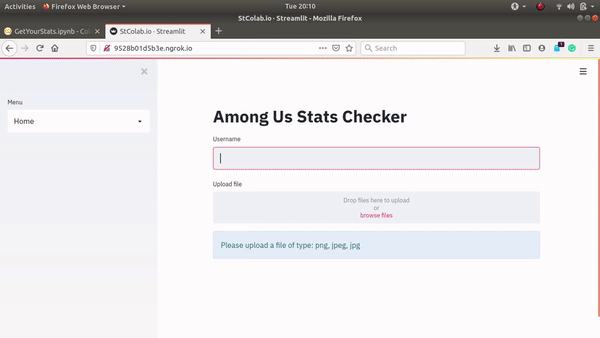

# AmongUs_StatsChecker
Given a screenshot of official stats, shows your individual performance and ranks you among the peers

## How to try out Statistics Checker

If you just want to get up-and-running with the project, open the code in google Colab [by clicking on this link](https://colab.research.google.com/github/faizankshaikh/AmongUs_StatsChecker/blob/main/GetYourStats.ipynb), run all the cells in sequential order to host the web service, and use the weblink created at the end of the notebook. You can use the web service as shown in the video below

On the other hand, if you are technically savvy, you can change the code and try to print/plot more detailed stats using the pandas dataframe "df"

## How to collaborate on the Project

### For non-technical collaborators

If you want to collaborate on the project, you can help make the image parsing algorithm better by submitting your screenshot of the official stats. The more screenshots we have, the better we can train the algorithm. Please [submit your screenshots here](https://forms.gle/knaupar22huD2uJo8)

### For technical collaborators

The project as of now is simplistic and can be improved algorithmically / UI wise, or can have a better statistical analysis. If you're interested in collaboration, you can contribute to the improvements noted. Here's a non-exhaustive list of the TODOs

* UI improvements

- [ ] Better display of Individual Statistics
- [ ] Better display of Aggregate Statistics
- [ ] Separate page for Current Leaderboard (ranked according to win-rates)

* Algorithmic / Code Improvements

- [ ] As of now, the project uses a pretrained Deep Learning model (uses EasyOCR). In order to improve the performance, the model can be finetuned on this particular data which could give a substantial boost in the accurate detection of the numbers in the screenshots
- [ ] Hypothetically, an object oriented paradigm could make the code approachable for new contributions. At the moment, the code is simplistic and mainly functional

* Hosting and Security

- [ ] For now, the web service is hosted temporarily on Google Colab because of logistic difficulties (requirement of GPU system). Ideally it could be hosted on a cloud service for a permanent access to the website
- [ ] The code as of now has minimal unit testing, which is unthinkable for a deployable project

Along with this, if you have any general suggestions / feedback, you can create a github issue or contact me directly on faizankshaikh at gmail.
